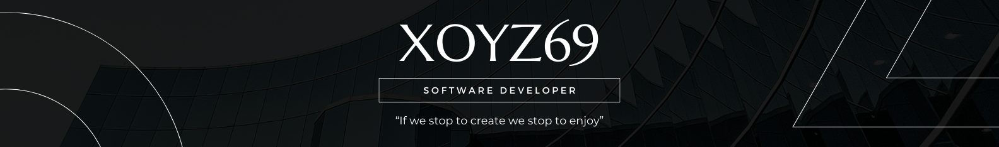
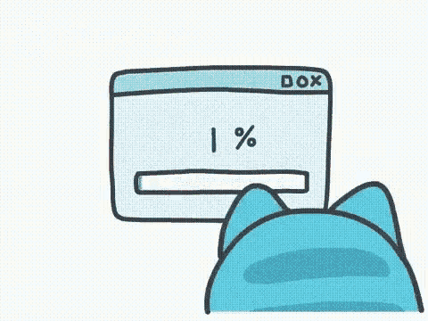

<!--
    Using this color palette: https://coolors.co/palette/d8f3dc-b7e4c7-95d5b2-74c69d-52b788-40916c-2d6a4f-1b4332-081c15
-->

<link rel="stylesheet" href="css/style.css">

## `> user.generate_summary()`

### Hi I'm Kevin,

I'm a German guy who is addicted to programming and anime, trying to learn Japanese on the side while also further increasing my knowledge in my techstack.

I'm always open for contact so just write me :D

## `> user.get_techstack()`

    <a href="https://www.python.org/">
    
    
    
    
    
    
    

## `> user.get_projects()`

The projects listed here are the ones I feel comfy with to share. Nevertheless do **not** expect a stable experience unless there is a stable release :P

  

    
       
      Yoshida
       
      
  

  

    
       Benchmark&#x2011;X
       
      
  

